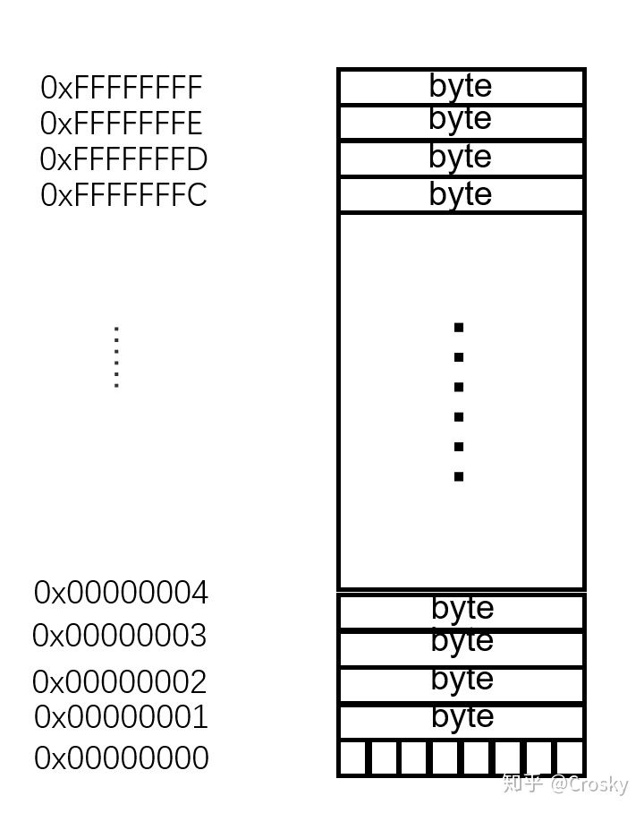

**markdown内容：Python函数嵌套、回调函数、闭包、装饰器和类**

# 一、函数嵌套
## 1.1、作用域和嵌套函数
LEGB查找规则的 **E** ， **E** 包括了任意外层函数局部作用域的形式。嵌套作用域有时也叫作静态嵌套作用域。

## 1.2、变量名查找规则：LEGB 规则
对于一条**def**语句：

​ ---在默认情况下，变量名赋值会创建或者改变局部变量；

​ ---变量名引用至多可以在四个作用域内进行查找：首先是局部，其次是外层的函数（如果有的话），之后是全局，最后是内置。

​ ---使用**global**和**nonlocal**语句声明的名称将赋值的变量名分别映射到外围的模块和函数的作用域。

​ 所有函数 **def** 语句内赋值的变量名默认均为局部变量。函数能够随意使用在外层函数或者全局作用域中的变量名，但要改变其属性必须声明为非局部变量和全局变量。

**LEGB**规则
（1）、当你在函数中使用未限定的变量名时，Python将查找4个作用域并在第一次找到该变量名的地方停下来：首先是局部作用域（L），其次是外一层的def或lambda的局部作用域（E），之后是全局作用域（G），最后是内置作用域（B）。如果在这一过程中没有被查找到，Python会报错。

（2）、当你在函数中给一个变量名赋值时，（而不是只在一个表达式中对其进行引用），Python便会创建或改变局部作用域的变量名，除非该函数变量名已经在该函数中被声明为局部变量。

（3）、当你在所有函数的外面给一个变量名赋值时，此时的局部作用域就是全局作用域。

## 1.3、global语句
**global**语句包含关键词**global**，其后跟着一个或多个由 ‘，’ 分割开的变量名。当函数主体被赋值或引用时，所有列出来的变量名被映射到整个模块的作用域内。

```
x = 1

def cal():
    global x
    x = 17
    print('function is over')

cal()       #out: function is over
print(x)    #out: 17
```

# 二、回调函数
## 2.1、回调函数：通过一个函数指针调用的函数。
如果你把函数的指针（地址,简单理解就是不带括号如:func）作为一个参数传递给另外一个函数，当这个指针被用来调用其所指向的函数时，我们就说这是一个回调函数。**回调函数不是由该函数的实现方法直接调用，而是在特定的事件或条件发生时由另外的一方调用的，用于对该事件或条件进行响应**。

**在Python中，函数本身也是对象**，所以可以将函数作为参数传入另一函数并进行调用。

回调函数还可以进行异步调用，即非阻塞调用，通常用在多线程或者多进程中。

```
def calculate(x,y,func):
    return func(x,y)

def max(x,y):
    while x>y:
        print(x)
    else:
        print(y)

def sum(x,y):
    print(x+y)

if __name__ == "__main__":
    result_max = calculate(5,7,max)
    print(result_max)
    result_sum = calculate(5,7,sum)
    print(result_sum)
```

## 2.2、C语言指针：指针是一种保存变量地址的变量
C语言里面，变量存放在内存之中，而内存其实就是一组有序字符串组成的数组，每个字节有惟一的内存地址。CPU通过内存寻址对存储在内存中的某个指定数据对象的地址进行定位。这里，数据对象是指内存中的一个指定数据类型的数值或字符串，他们都有一个自己的地址，而指针便是保存这个地址的变量。也就是说，指针是一种保存变量地址的变量。

内存是一组有序字节组成的数组，数组中，每个字节大小固定，都是8 bit。这些连续字节从0开始进行编号，每个字节都有唯一的一个编号，这个编号便是内存地址。如图：

左侧十六进制编号就是内存地址，每个内存地址对应一个字节的内存空间。而指针变量保存的就是这个编号，也即内存地址。


# 三、工厂函数（factory function）：闭包（closure）
## 3.1、什么是闭包
闭包能够记忆外层作用域里的值，不管那些嵌套作用域是否还在内存中存在。从结果上看，它们附加了内存包（又称状态记忆），它对于每一个被创建的嵌套函数副本而言都是局部的，从这一作用来看，它们经常提供了一种类的简单替代方法。

在一个外函数中定义了一个内函数，内函数里运用了外函数的临时变量，并且**外函数的返回值是内函数的引用**。这样就构成了一个闭包。

一般情况下，在我们认知当中，如果一个函数结束，函数的内部所有东西都会释放掉，还给内存，局部变量都会消失。但是**闭包是一种特殊情况，如果外函数在结束的时候发现有自己的临时变量将来会在内部函数中用到，就把这个临时变量绑定给了内部函数，然后自己再结束。**

使用闭包的过程中，一旦外函数被调用一次返回了内函数的引用，虽然每次调用内函数，是开启一个函数执行过后消亡，但是闭包变量实际上只有一份，每次开启内函数都在使用同一份闭包变量

## 3.2、如何调用
```
# 工厂函数

# 这是一个计算x的n次方的函数,外层函数变量是n,嵌套在里边的函数变量是x
def func_n(n):
    '''输入n返回一个可以计算x的n次方的函数func_x'''
    def func_x(x):
        '''输入x,返回x的n次方'''
        return x ** n
    return func_x

f_p2 = func_n(2)  # n=2,f_p2 = func_x,切func_x内部的n=2
result = f_p2(4)  # n=2, result = func_x(4),返回是4**2
print(result)
```

**解析:**

`f_p2= func_n(2)`,在执行这一句时,其实python内部时这样的
```
def func_x(x):
    return x ** 2
f_p2 = func_x
```
然会执行`result = f_p2(4)`,此时python会执行以下代码
```
result = 4 ** 2
```